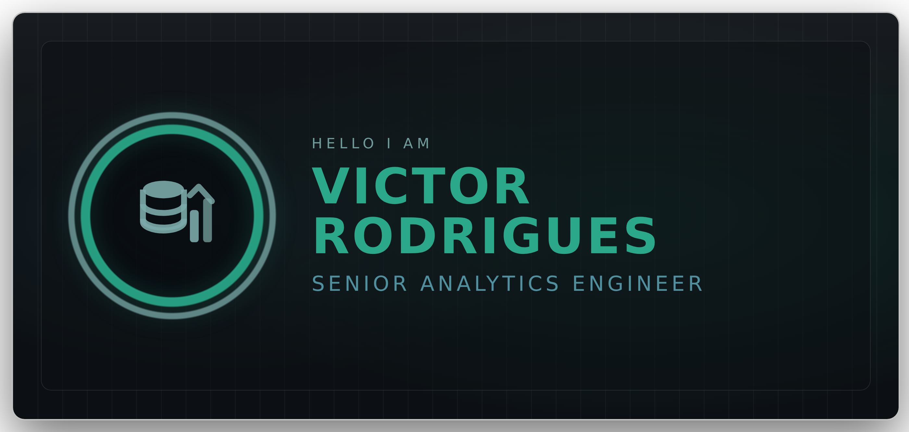

  <!-- HERO -->
  
   

  <!-- METRICS (50% / 50%) -->
  

    
    
  

 
  <!-- TECH STACK -->
  

  &nbsp;&nbsp;&nbsp;
  &nbsp;&nbsp;&nbsp;
  &nbsp;&nbsp;&nbsp;
  &nbsp;&nbsp;&nbsp;
  &nbsp;&nbsp;&nbsp;
  &nbsp;&nbsp;&nbsp;
  &nbsp;&nbsp;&nbsp;
  &nbsp;&nbsp;&nbsp;
  

   

  <!-- CONTACT -->
  

    
    
  

  

